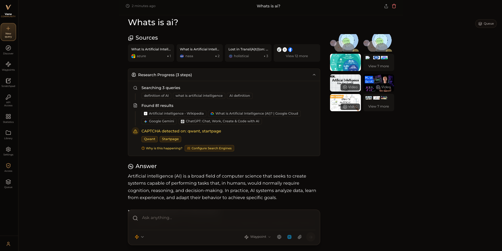
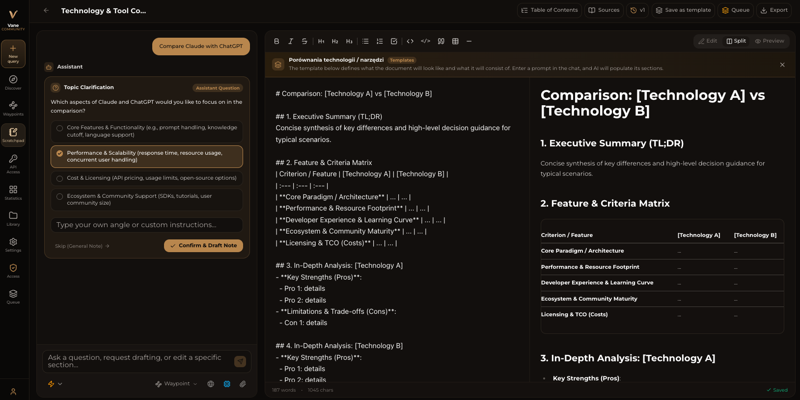
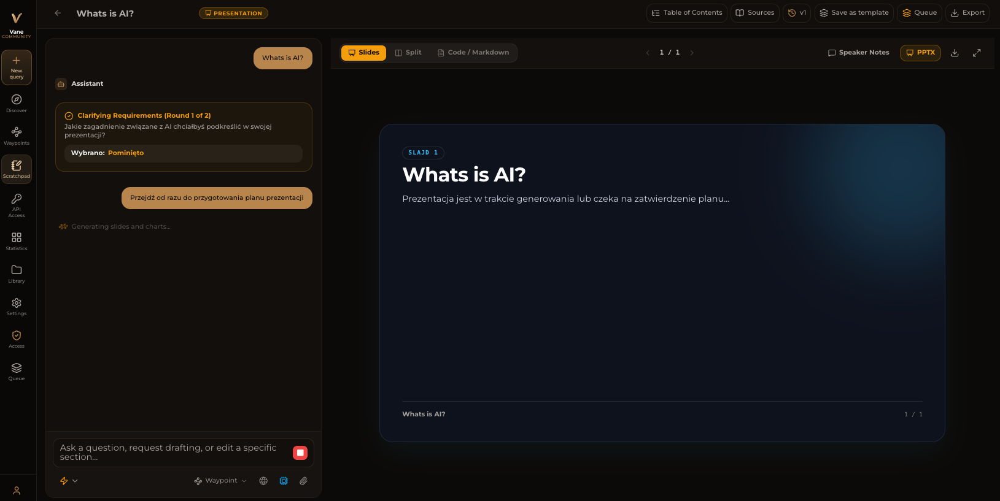
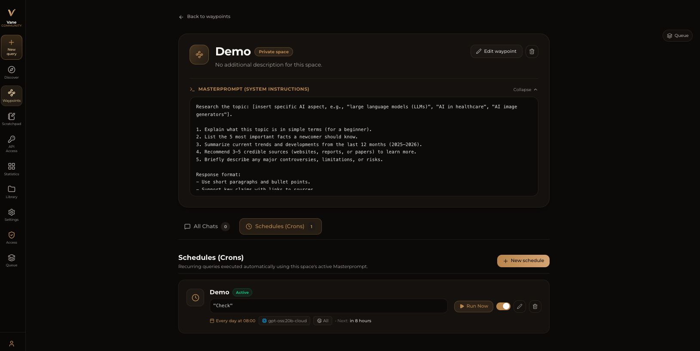
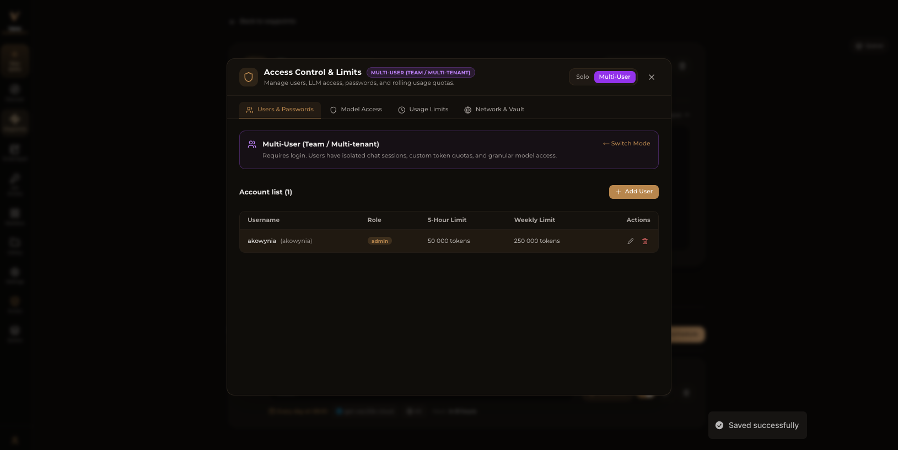
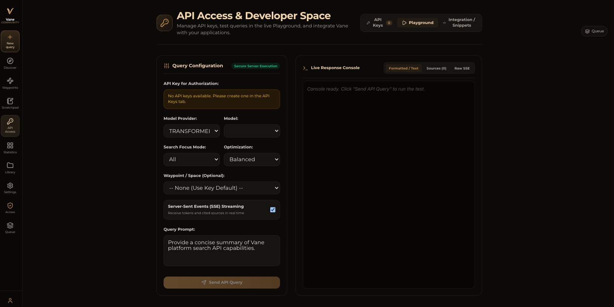
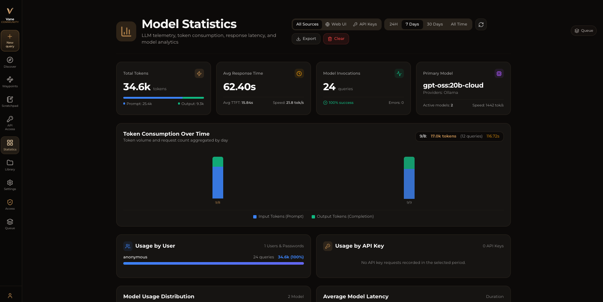

# Vane-Community 🔍

[](LICENSE)
[](CHANGELOG.md)
[](https://hub.docker.com/r/akowynia/vane-community)

Vane-Community is a **privacy-focused AI answering engine** that runs entirely on your own hardware. It combines knowledge from the vast internet with support for **local LLMs** (Ollama) and cloud providers (OpenAI, Anthropic Claude, Google Gemini, Groq, and more), delivering accurate answers with **cited sources** while keeping your searches completely private.

> This project is an independent continuation based on [Vane](https://github.com/ItzCrazyKns/Vane) v1.12.2 by [ItzCrazyKns](https://github.com/ItzCrazyKns). Starting from v1.0.0, it is developed and maintained independently by [akowynia](https://github.com/akowynia) — blog: [lowcyai.pl](https://lowcyai.pl) — together with a growing community of contributors. See [CHANGELOG.md](CHANGELOG.md) for what's changed.



Want to know more about its architecture and how it works? You can read it [here](docs/architecture/README.md).

## ✨ Core Features

🤖 **Support for all major AI providers** - Use local LLMs through Ollama or connect to OpenAI, Anthropic Claude, Google Gemini, Groq, and more. Mix and match models based on your needs.

⚡ **Smart search modes** - Choose Speed Mode when you need quick answers, Balanced Mode for everyday searches, or Quality Mode for deep research.

🧭 **Pick your sources** - Search the web, discussions, or academic papers.

🧩 **Widgets** - Helpful UI cards that show up when relevant, like weather, calculations, stock prices, and other quick lookups.

🔍 **Web search powered by SearXNG** - Access multiple search engines while keeping your identity private.

📷 **Image and video search** - Find visual content alongside text results. Search isn't limited to just articles anymore.

📄 **File uploads** - Upload documents and ask questions about them. PDFs, text files, images - Vane-Community understands them all.

🌐 **Search specific domains** - Limit your search to specific websites when you know where to look. Perfect for technical documentation or research papers.

💡 **Smart suggestions** - Get intelligent search suggestions as you type, helping you formulate better queries.

📚 **Discover** - Browse interesting articles and trending content throughout the day. Stay informed without even searching.

🕒 **Search history** - Every search is saved locally so you can revisit your discoveries anytime. Your research is never lost.

---

## 🆕 What's New Since v1.12.2

Vane-Community v1.0.0 adds a substantial set of new capabilities on top of the base it was forked from. Full details for each are in [docs/architecture](docs/architecture/README.md); a complete list of changes is in [CHANGELOG.md](CHANGELOG.md).

👥 **Multi-user accounts & access control** - Add multiple accounts with role-based permissions (admin/member), per-user and per-guest token limits (5h/daily/weekly/monthly), and control which providers and models each user can access. See [Roles, Vault & Multi-user Security](docs/architecture/ROLES_VAULT_AND_MULTIUSER.md).

🧭 **Waypoints** - Persistent, personalized spaces with their own custom system instructions and context, so you can keep a focused assistant for a specific project or topic. See [Waypoints](docs/architecture/WAYPOINTS.md).

⏰ **Waypoint Crons** - Schedule recurring research and refresh jobs inside a Waypoint, so it stays up to date on its own. See [Waypoint Crons](docs/architecture/WAYPOINT_CRONS.md).

📝 **Scratchpad** - An AI-assisted canvas/notes workspace (similar to ChatGPT Canvas or Claude Artifacts) with document versioning, templates, and an integrated research chat. See [Scratchpad](docs/architecture/SCRATCHPAD.md).

🎬 **AI Presentations** _(Beta)_ - Generate slide decks straight from the Scratchpad: the assistant interviews you, researches the web, plans the deck, and exports a ready-to-use PPTX file with charts and images. See [AI Presentation Generator](docs/architecture/PRESENTATIONS.md).

🔑 **API Access & Developer Playground** - Issue scoped API keys with rate limiting and usage tracking, and try requests directly from an in-app playground. See [API Access & Developer Playground](docs/architecture/API_ACCESS_AND_PLAYGROUND.md).

📊 **Model Statistics** - A telemetry dashboard tracking token usage and latency per model, so you can see what your setup actually costs. See [Model Statistics & Telemetry](docs/architecture/MODEL_STATISTICS.md).

🧵 **Model task queue** - Smarter scheduling for local providers (Ollama, LM Studio) that avoids unnecessary VRAM reloads when switching between models. See [Model Task Queue & Model-Aware Scheduling](docs/architecture/PROVIDER_QUEUE_AND_MODEL_SCHEDULING.md).

🎛️ **Quality Mode token budgets** - Configurable limits for deep-research mode, so long research sessions stay predictable. See [Quality Mode Optimizations](docs/architecture/QUALITY_MODE_OPTIMIZATIONS.md).

🔎 **Dynamic SearXNG engine management** - Enable/disable search engines and manage their API keys (Brave, Bing, Google, Mojeek, PubMed) from the UI, backed by an encrypted credential vault. See [Search Engines Configuration & API Keys](docs/architecture/SEARCH_ENGINES_CONFIG.md).

🔒 **Hardened security** - SSRF protection (including DNS-rebinding and cloud metadata defenses), constant-time API key checks, CSRF origin validation, and automatic secret masking in API responses. See [Security Architecture](docs/architecture/SECURITY.md).

🌍 **Full internationalization** - The entire app, including the setup wizard, is available in 12 languages. See [Localization System](docs/architecture/LOCALIZATION.md).

---

## 📸 Screenshots

| | |
|---|---|
|  **Scratchpad** - notes, versioning, and AI research side by side. |  **AI Presentations** _(Beta)_ - from a topic to a finished slide deck. |
|  **Waypoints** - personalized spaces with their own instructions and context. |  **Access Control** - manage users, roles, and usage limits. |
|  **API Playground** - try the REST API without leaving the app. |  **Model Statistics** - token usage and latency at a glance. |

---

## 📦 Installation

There are 2 main ways of running Vane-Community: with Docker (recommended) or without Docker.

### Getting Started with Docker (Recommended)

Pull and run the pre-built image from [Docker Hub](https://hub.docker.com/r/akowynia/vane-community) — includes the bundled SearXNG search engine:

```bash
docker run -d \
  -p 3000:3000 \
  -p 8080:8080 \
  -v vane-community-data:/home/vane-community/data \
  --name vane-community \
  akowynia/vane-community:latest
```

Once running, open your browser and navigate to **http://localhost:3000** to complete the initial setup.

#### Using Vane-Community with Your Own External SearXNG Instance

If you already have SearXNG running externally, use the lightweight `slim` variant instead:

```bash
docker run -d \
  -p 3000:3000 \
  -e SEARXNG_API_URL=http://your-searxng-url:8080 \
  -v vane-community-data:/home/vane-community/data \
  --name vane-community \
  akowynia/vane-community:slim-latest
```

**Important**: Make sure your external SearXNG instance has:
- JSON format enabled in settings (`formats: [html, json]`)
- Wolfram Alpha search engine enabled

#### Building From Source Instead

Prefer to build the image yourself, e.g. after modifying the code?

```bash
# Full variant (bundled SearXNG)
docker build -t vane-community .

# Slim variant (bring your own SearXNG)
docker build -f Dockerfile.slim -t vane-community:slim .
```

Then run it the same way as above — just swap the image name in `docker run` for your local tag (`vane-community` or `vane-community:slim`).

---

### Non-Docker Installation

1. Install SearXNG and allow `JSON` format in the SearXNG settings. Make sure Wolfram Alpha search engine is also enabled.
2. Install dependencies:

   ```bash
   yarn install
   ```

3. Build the application:

   ```bash
   yarn build
   ```

4. Start the application:

   ```bash
   yarn start
   ```

5. Open your browser and navigate to **http://localhost:3000** to complete the setup and configure your settings (API keys, models, SearXNG URL, etc.).

---

### 🔧 Troubleshooting

#### Local OpenAI-API-Compliant Servers

If Vane-Community tells you that you haven't configured any chat model providers, ensure that:

1. Your server is running on `0.0.0.0` (not `127.0.0.1`) and on the same port configured in the API URL.
2. You have specified the correct model name loaded by your local LLM server.
3. You have specified the correct API key (or non-empty placeholder if not required).

#### Ollama Connection Errors

If you encounter connection errors with Ollama:

1. **Check your Ollama API URL:** Ensure that the API URL is correctly set in the settings menu.
2. **Update API URL based on OS:**
   - **Windows / Mac (Docker):** Use `http://host.docker.internal:11434`
   - **Linux (Docker):** Use `http://<private_ip_of_host>:11434`
3. **Linux Users - Expose Ollama to Network:**
   - In `/etc/systemd/system/ollama.service`, add `Environment="OLLAMA_HOST=0.0.0.0:11434"`.
   - Run `systemctl daemon-reload && systemctl restart ollama`.

---

## 🔍 Using as a Default Search Engine

To use Vane-Community directly from your browser's address/search bar:

1. Open your browser's settings -> Search Engines.
2. Add a new search engine with query URL: `http://localhost:3000/?q=%s`.
3. Set as default or assign a shortcut keyword.

---

## 💻 API Documentation

Vane-Community provides a full REST API for programmatic search and answering:
- See the complete [Search API Documentation](docs/API/SEARCH.md).

---

## 🤝 Contribution

Vane-Community is developed independently and in the open. Contributions, bug reports, and suggestions are welcome! Please check out [CONTRIBUTING.md](CONTRIBUTING.md) for details on setting up development workflows.
