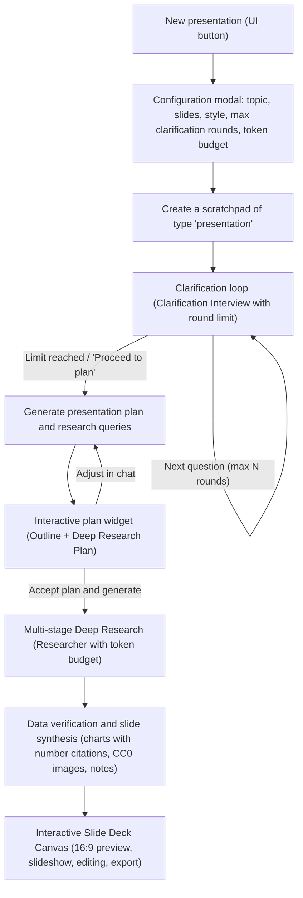

# Architecture Concept: AI Presentation Generator (Slide Deck Generator with Deep Research)

## 1. Introduction and Purpose

The **AI Presentations** module is an extension of the Scratchpad workspace in Vane that allows users to create professional, substantive, and visually rich multimedia presentations (slide decks) based on advanced web research, an iterative requirement-clarification process, and intelligent planning.

The existing notes mode (`note`) remains fully functional, and the user is given a dedicated presentation mode (`presentation`) accessible directly from the main Scratchpad interface.

---

## 2. Key Requirements and User Flow



---

## 3. Presentation Settings and Configuration Panel

While creating a presentation, and in the working panel, the user has access to advanced parameters:

1. **Content parameters**:
   - **Presentation topic**: a text field for describing the subject.
   - **Number of slides**: a slider / value picker (3 to 20 slides, default 8).
   - **Visual theme**: Dark Modern, Minimal Light, Deep Tech / Cyber, Business Emerald, Elegant Warm Gold.
   - **Target audience / tone**: Business / Executive, Engineers / Architects, Education / Students, Pitch Deck.

2. **AI process-control parameters (safeguards against loops and runaway cost)**:
   - **Maximum number of clarification rounds (`maxClarificationRounds`)**:
     - Range: from 0 (disabled — go straight to the plan) to 5 rounds (default: 2 or 3).
     - The system tracks the current round number in metadata (`clarificationRound: 1, 2...`). Once the defined limit is reached, the assistant unconditionally ends the interview and generates the plan outline.
   - **Research token budget / cap (`tokenBudgetCap`)**:
     - Options: e.g. 15k, 30k, 60k, 100k tokens, or a dynamic limit tied to the mode (`speed`, `balanced`, `quality`).
     - The `Researcher` monitors token usage and safely finalizes the process once the threshold is reached.
   - **Web research intensity (`researchIntensity`)**:
     - *Fast* (1-2 key queries), *Balanced* (2-4 queries), *Deep / Deep Research* (up to 8 queries with analysis of academic sources).
   - **Speaker notes generation (`includeSpeakerNotes`)**: on / off.
   - **Include citations and sources (`includeCitations`)**: on / off.

---

## 4. Verification of Numeric Data on Charts (Chart Grounding & Data Citations)

To eliminate the risk of hallucinated numbers and fabricated charts generated by the LLM, a multi-layered factual-grounding mechanism is used:

### 4.1. Grounded Chart Data Schema

Charts are generated in a structured format that explicitly ties every numeric value to a source index and the original quote:

```json
```chart
{
  "type": "bar",
  "title": "Comparison of LLM model parameters (billions)",
  "xAxisLabel": "Model",
  "yAxisLabel": "Parameter count (B)",
  "series": [
    {
      "name": "Base parameters",
      "data": [
        {
          "label": "Llama 3 8B",
          "value": 8,
          "sourceIndex": 1,
          "exactQuote": "Llama 3 is offered in 8B and 70B parameter sizes"
        },
        {
          "label": "Llama 3 70B",
          "value": 70,
          "sourceIndex": 1,
          "exactQuote": "Llama 3 is offered in 8B and 70B parameter sizes"
        },
        {
          "label": "GPT-4 (MoE est.)",
          "value": 1800,
          "sourceIndex": 3,
          "exactQuote": "GPT-4 architecture is estimated to have ~1.8 trillion parameters across 16 experts"
        }
      ]
    }
  ],
  "sourceCitations": [1, 3],
  "verifiedFromSearch": true
}
```
```

### 4.2. Rule: "No data = a qualitative diagram instead of a made-up chart"

In the AI system instructions (`presentationGenerator`):
- If the model cannot find precise, verified numbers for a given topic within the gathered search results (`<search_results>`), **it is strictly forbidden to fabricate data for numeric charts**.
- In that case, the assistant generates a Mermaid architecture/flow diagram, a vector relationship infographic, or a qualitative table instead.

### 4.3. Interactive Source Badges and Tooltips in `SlideChartRenderer`

- Next to every bar, data point, or pie slice on a chart, an interactive badge with the source number is shown (e.g. `[1]`).
- On hovering over a data point:
  - A tooltip appears with the exact quote from the source (`exactQuote`), the domain name, and the publication title.
  - The corresponding source in the side source panel is immediately highlighted.
- Below the chart, a clickable bibliography footer with verified links is generated.

---

## 5. Copyright Safety (Images and Illustrations)

1. **Charts and infographics**: rendered 100% procedurally in SVG / Canvas.
2. **Process diagrams**: rendered using Mermaid.js.
3. **External photos and images**:
   - Sourced exclusively from Public Domain repositories and free Creative Commons licenses (Wikimedia Commons, Openverse CC0/CC-BY).
   - Commercial stock-photo domains (Shutterstock, Getty, Adobe Stock, iStock, etc.) are entirely forbidden and blocked.
   - Every external illustration includes metadata: author, license, source link, and a public-domain notice.
4. **Generated graphics**: vector diagrams generated live by the SVG procedure engine.

---

## 6. Data Model (SQLite / Drizzle ORM)

Extension of the `scratchpads` table:
- `type`: `'note' | 'presentation'` (default `'note'`).
- `metadata`: JSON storing:
  ```ts
  interface PresentationMetadata {
    slideCount: number;
    theme: string;
    targetAudience: string;
    maxClarificationRounds: number;
    currentClarificationRound: number;
    tokenBudgetCap?: number;
    researchIntensity: 'speed' | 'balanced' | 'quality';
    includeSpeakerNotes: boolean;
    includeCitations: boolean;
    plan?: {
      slides: Array<{
        title: string;
        goal: string;
        visualType: 'chart' | 'mermaid' | 'infographic' | 'table' | 'cards';
        points: string[];
      }>;
      researchQueries: string[];
      status: 'draft' | 'approved';
    };
  }
  ```

---

## 7. UI Component Architecture

1. **`CreatePresentationDialog.tsx`**: the starting modal with full parameter sliders, a clarification-round limit, and a token budget.
2. **`PresentationCanvas.tsx`**: a 16:9 slide player with thumbnails (filmstrip), a fullscreen mode (F11 / Slideshow), a slide-out speaker notes panel, and quick export to PPTX and Markdown.
3. **`SlideChartRenderer.tsx`**: the chart engine (Bar, Line, Pie, Doughnut, Metric Cards) with citation verification and interactive source highlighting.
4. **`SlideVisualRenderer.tsx`**: the engine for Mermaid diagrams, SVG infographics, and safe CC0 images with license metadata.
5. **`PresentationClarificationBox.tsx`**: the clarification-loop widget with a round indicator (e.g. `Round 1 of 3`), option selection, and "Skip straight to planning" / accept buttons.
6. **`PresentationPlanWidget.tsx`**: the plan-acceptance widget with a preview of the research queries and a button to generate the whole deck.
7. **`PresentationCanvas.tsx`**: also has a dedicated quick-export button to `.pptx` (PowerPoint) and Markdown in the slide toolbar.

---

## 8. Export to Microsoft PowerPoint (`.pptx`)

A dedicated generator, `src/lib/presentation/exportPptx.ts` (building an OpenXML PresentationML PPTX archive via `JSZip`):
- Produces a fully valid `.pptx` file in 16:9 format.
- Reproduces the selected color theme (Dark Modern, Minimal Light, Cyber Tech, Business Emerald, Warm Gold).
- Generates a title slide, content slides with key bullet points and tables, speaker notes in the notes pane, and a bibliography slide.
- The PPTX download button sits directly in the presentation player's toolbar (`PresentationCanvas`).

---

## 9. Multi-language Support (i18n)

All new elements are translated into 12 languages (`pl`, `en`, `de`, `es`, `fr`, `it`, `pt`, `ru`, `uk`, `zh`, `ja`, `ko`).
