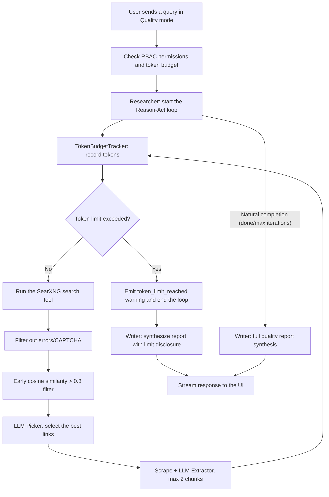

# Quality Mode (Deep Research) Optimizations and Safeguards

## 1. Concept and Goals

**Quality (Deep Research) mode** runs a multi-stage investigation using a Reason-Act loop (typically 5–8 iterations), during which the agent plans queries, aggregates results from SearXNG, scrapes and analyzes page content, and synthesizes a final report.

The optimizations described here address four key challenges:
1. **Securing the Reason-Act loop**: eliminating looping and inconsistent tool calls.
2. **Early relevance filtering (cosine similarity > 0.3)**: discarding irrelevant pages and junk results before running the LLM picker and expensive scraping.
3. **Cost control and a hard token budget (`qualityModeMaxTokens`)**: guarding against uncontrolled token consumption when using external paid models (e.g. GPT-4o, Claude 3.5 Sonnet), with a split by role (guests vs. logged-in users) and configuration in the Access Control panel.
4. **High-quality synthesis and honest reporting**: replacing the artificial "minimum 2000 words" requirement with an instruction to maximize information density, and a transparent disclosure clause when research is cut short due to token-budget exhaustion.

---

## 2. The Reason-Act Loop and Tool Architecture

All search modes (`speed`, `balanced`, `quality`) share the `Researcher.research()` loop mechanism.

- A `done` tool call is treated as a signal that research has finished and triggers an immediate transition to report synthesis.
- The `executableCalls` safeguard filters the `done` tool out of the list of parallel action calls, preventing the erroneous execution of a non-existent action.
- Whenever a `done` tool call appears among the LLM's calls, the loop immediately ends the research phase and does not allow further, unnecessary queries to run.

---

## 3. Early Vector Relevance Filter (`baseSearch.ts`)

Previously, vector filtering only happened after pages were scraped, or only in Speed mode. In Quality mode, the LLM picker had to process every raw snippet returned by the search engine.

### New page-selection flow:
1. **Fetch results from SearXNG**: aggregate snippets and links from multiple engines.
2. **Initial anti-bot filtering**: discard pages with an error message, 403, 429, CAPTCHA, etc.
3. **Compute snippet embeddings**: vector comparison via `cosineSimilarity(queryEmbedding, snippetEmbedding)`.
4. **Threshold filter `similarity > 0.3`**: discard results below the semantic-relevance threshold.
5. **Vector ranking and selection**: only the top, vector-verified candidates are passed to the LLM picker.
6. **Extraction and chunk limit**: text extraction is capped at a maximum of **2 most relevant chunks** per page (instead of scraping entire multi-page documents), which cuts token overhead by more than 60%.

---

## 4. Hard Token Budget (`TokenBudgetTracker`)

### Token Usage Calculation in Quality Mode
A single full iteration that scrapes 2 pages consumes, on average:
- Prompt + Researcher loop history: **~3,500 tokens**
- LLM picker (link selection): **~1,800 tokens**
- LLM extractor (analysis and extraction of 2 chunks): **~8,200 tokens**
- **Total per iteration**: **~13,500 tokens**

For a full research run (5–6 iterations), total consumption is roughly **65,000 – 75,000 tokens**.

### Implemented limits:
- **For logged-in / solo / global users**: **75,000 tokens** (default, configurable via `Config['globalLimits'].qualityModeMaxTokens`). Allows a full 5–8 iterations. Cost with GPT-4o: ~$0.26 per research run; with local models (Ollama): $0.
- **For guests (`guestSettings`)**: **35,000 tokens** (default, configurable via `Config['guestSettings'].qualityModeMaxTokens`). Allows 2–3 iterations, protecting publicly exposed instances from abuse.

### How it works:
1. In every action (`webSearch`, `academicSearch`, `socialSearch`, `baseSearch`) and every model call inside the `Researcher` loop, the `TokenBudgetTracker` object records the actually consumed tokens (or a character-based approximation, `chars / 3.8`, when usage metadata is unavailable).
2. Once the budget is exceeded, the loop immediately stops further research.
3. A `search_warning` sub-step is emitted with the type `token_limit_reached`.
4. The `isTokenLimitReached: true` flag is returned.

---

## 5. Writer Prompt Instructions (`writer.ts`)

### Removing the Rigid 2000-word Requirement
The instruction `The report should be a comprehensive long-form article, at least 2000 words.` was removed and replaced with a requirement for:
- **Maximum factual density**: an accurate, in-depth presentation of facts, figures, tables, and sources without padding or artificially lengthening the text.
- **Natural structure**: the report is as long as is genuinely needed to faithfully present the gathered material.

### Honest Handling of Interrupted Research (`isTokenLimitReached`)
When `searchResults.isTokenLimitReached === true`, the writer prompt receives a clause forcing a clear note to be placed at the top of the report:
> **Note**: The research was concluded after the allocated token budget was exhausted. The analysis below is based on the information gathered up to that point.

---

## 6. Data Flow Diagram

---

## 7. Code and File Changes

| Component | Files | Scope of changes |
| :--- | :--- | :--- |
| **Configuration & RBAC** | `src/lib/config/types.ts` `src/lib/config/index.ts` `src/lib/security/rbac.ts` | `qualityModeMaxTokens` fields in `globalLimits` and `guestSettings`, the `qualityModeTokenLimit` resolver in `AuthUser`. |
| **Agent types** | `src/lib/types.ts` `src/lib/agents/search/types.ts` | The `token_limit_reached` type, the `isTokenLimitReached` field in `ResearcherOutput`, the `TokenBudgetTracker` interface. |
| **Search and filtering** | `src/lib/agents/search/researcher/actions/search/baseSearch.ts` `webSearch.ts`, `academicSearch.ts`, `socialSearch.ts` `registry.ts` | Early vector filter `cosine similarity > 0.3`, a limit of 2 chunks per page, passing the tracker down into LLM subtasks. |
| **Researcher loop** | `src/lib/agents/search/researcher/index.ts` | The `TokenBudgetTracker` class, counting prompt/history/response tokens, stopping the loop at the limit. |
| **Writer & API** | `src/lib/prompts/search/writer.ts` `src/lib/agents/search/index.ts` `src/lib/agents/search/api.ts` `src/app/api/chat/route.ts` `src/app/api/search/route.ts` | Removal of the 2000-word limit, implementation of the disclosure clause, passing `qualityModeTokenLimit` from the user down to the agent. |
| **UI and management** | `src/components/Settings/AccessControlDialog.tsx` | The Quality Mode token-limit configuration control in the `Limits` tab. |
| **Multi-language support (i18n)** | `src/lib/i18n/locales/*.ts` (12 languages) | Translation keys for `qualityModeLimit`, `qualityModeLimitPlaceholder`, `qualityModeLimitDesc`. |
