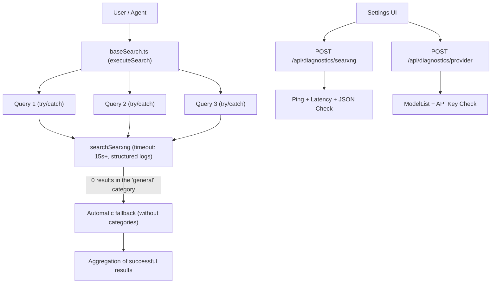

# Architecture of Connection Diagnostics and SearXNG Search Resilience

This document describes the architecture of the diagnostic mechanisms, extended logging, and resilience against search query failures (Search Resilience) that were implemented to address a set of recurring reliability problems.

---

## 1. Problem Context and Root Causes

1. **Lack of logging and instrumentation:**
   - When a SearXNG instance or a model provider failed (timeout, 500 errors, connection refused, JSON parse errors), errors were silently swallowed or thrown without detailed context in the Docker logs.
   - The UI offered no way to test a connection before saving configuration, so users ended up configuring endpoints blind.

2. **Incorrect "Found 0 results" reporting in Speed/Balanced modes:**
   - Contrary to what it might look like at first glance, Vane **never discarded results because of a `number_of_results: 0` field**.
   - The actual cause in Speed and Balanced modes was the construction `Promise.all(input.queries.map(search))`, which had no per-query error handling:
     - When 2–3 parallel queries were issued to SearXNG and even one of them exceeded the fixed 10-second timeout or hit a rate limit, the entire `Promise.all` threw an exception.
     - `ActionRegistry.executeAll` caught that error and returned an empty `results: []` array, irrecoverably discarding the results from the other queries that had actually succeeded.
     - In addition, the fixed `categories: ['general']` filter caused a lack of results on external SearXNG instances that didn't have engines configured in that category.

3. **Losing the external SearXNG address:**
   - Earlier versions replaced `localhost` with `127.0.0.1`, and the `/data/config.json` file took priority over the `SEARXNG_API_URL` environment variable, blocking updates from that variable after a container restart.

---

## 2. Solution Architecture

---

## 3. Search Engine Improvements (`src/lib/searxng.ts`)

1. **Configurable timeout:**
   - The default timeout was increased from 10s to 15s.
   - It can now be configured dynamically via the `SEARXNG_TIMEOUT` environment variable (in milliseconds).
2. **Structured telemetry logging:**
   - Every outgoing query logs the target URL and the query text.
   - Once a response is received, the execution time in milliseconds (`elapsed ms`), the number of results found, and any engines that reported a CAPTCHA or rate limit (`unresponsive_engines`) are recorded.
   - Connection and parsing errors carry full context (HTTP status code, duration, target host).

---

## 4. Parallel Query Resilience (`baseSearch.ts`)

1. **Sub-query error isolation:**
   - Every sub-query in the `search(q)` loop has a dedicated `try ... catch` block.
   - A failure in one query (e.g. a timeout or network error on one of three engines) no longer interrupts processing of the others or resets the array of results already found.
2. **Smart category fallback:**
   - If a query with `categories: ['general']` returns 0 results, the system automatically retries the query without a category restriction, preventing lost results on non-standard SearXNG instance configurations.
3. **Embedding error logging:**
   - Silent swallowing of embedding errors inside the `catch (err)` block was removed — if the embedding model fails, a `[baseSearch] Embedding calculation failed...` warning now appears in the logs, and the results are passed through immediately without data loss.

---

## 5. Diagnostics API (`/api/diagnostics/*`)

1. **`POST /api/diagnostics/searxng` endpoint:**
   - Verifies the URL against SSRF (`validateSearxngURL`).
   - Sends a test query while measuring latency (`latencyMs`).
   - Returns the number of active engines, the HTTP status, and any warnings.
2. **`POST /api/diagnostics/provider` endpoint:**
   - Safely validates the configuration of an LLM / embeddings provider (Ollama, OpenAI, Groq, Anthropic, etc.).
   - Tests the connection to the `/models` endpoint or the native SDK without first requiring the configuration changes to be saved.
   - Returns the number of available chat and embedding models along with the response time.

---

## 6. Settings UI

- Interactive **"Test connection"** buttons were added to the `SearXNG URL` section and to the model connection dialogs (`Add Connection`, `Update Connection`).
- The user gets immediate real-time feedback:
  - Success: a green label with the response time (e.g. `Connection successful (45ms)`).
  - Error: a red label with the exact reason for the failure (e.g. `HTTP 403`, `SSRF validation error`, `Timeout after 7000ms`).
