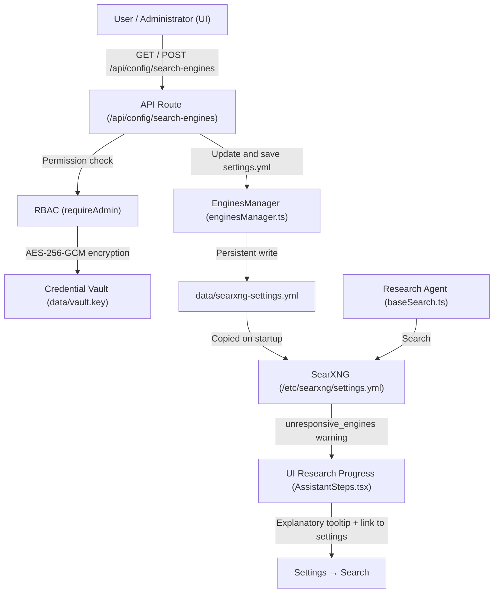

# Architecture of SearXNG Search Engine and API Key Management (Brave, Bing, Google, Mojeek, PubMed)

This document describes the architecture of dynamic SearXNG search-engine management from the Vane UI, secure integration of official API keys (Brave, Bing, Google Custom Search, Mojeek, PubMed/NCBI) with the Credential Vault mechanism, and safe default settings that eliminate false CAPTCHA and rate-limit warnings.

---

## 1. Background and Problem Analysis

The SearXNG search engine aggregates queries across many external search engines. In server environments (Docker, cloud, VPS, datacenter), some engines notoriously rejected queries from the very first search:

1. **DuckDuckGo (`CAPTCHA detected`):**
   - DuckDuckGo is protected by Cloudflare Bot Management.
   - Requests from Python HTTP libraries (`httpx`/`requests`, with no browser and no JavaScript environment) cannot solve the Cloudflare Turnstile / Proof-of-Work challenge, so a CAPTCHA challenge page is returned instead.
2. **Brave Search (`Rate limit reached / HTTP 429`):**
   - Brave disabled free scraping of the `search.brave.com` page.
   - Without an official API key, the Brave scraper in SearXNG is rejected 100% of the time with an HTTP 429 (Too Many Requests) status or a Cloudflare block.
3. **Mojeek (`Search engine error / 403`):**
   - Very restrictive per-IP limits for servers/VPNs in the HTML scraper. An official API is available.
4. **Yahoo (`Search engine error / 403 / XPath`):**
   - Forces a GDPR consent wall in Europe, or returns 403 Forbidden. No official public API is available.
5. **Bing / Google / PubMed:**
   - HTML-scraping-based search can occasionally run into blocks or rate limits, but all three offer official API keys.

---

## 2. Solution Architecture

---

## 3. System Components

### 3.1. Default SearXNG Configuration (`searxng/settings.yml`)

The configuration file ships with sensible defaults:
* **Stable engines enabled:** `google`, `bing`, `qwant`, `startpage`, `wikidata`, `wikipedia`, `github`, `hackernews`, `stackexchange`, `arxiv`, `pubmed`, `crossref`.
* **Block-prone engines disabled:** `duckduckgo`, `brave` (requires an API key), `yahoo`, `mojeek`, `google news`.

### 3.2. Engine Manager (`src/lib/searxng/enginesManager.ts`)

Responsible for:
* Reading and parsing the `engines:` section from the active `settings.yml` file.
* Categorizing engines (`web`, `academic`, `social`, `encyclopedia`, `news`).
* Flagging block-prone engines (`isProblematic: true`).
* Handling official API keys for the engines:
  - **Brave Search:** `https://brave.com/search/api/`
  - **Bing Web Search API:** `https://www.microsoft.com/en-us/bing/apis/bing-web-search-api`
  - **Google Custom Search API:** `https://developers.google.com/custom-search/v1/overview`
  - **Mojeek Search API:** `https://www.mojeek.com/services/search/api/`
  - **PubMed / NCBI E-Utilities API:** `https://ncbiinsights.ncbi.nlm.nih.gov/2017/11/02/new-api-keys-for-the-e-utilities/`
* Secure key storage:
  - Keys are encrypted in the vault (`vault.encrypt`) under `search.apiKeys.<engine>` (with backward compatibility for `search.braveApiKey`).
  - The `api_key: "..."` parameter is injected into the relevant engine's section in `settings.yml`, and the engine is automatically enabled once a valid key is configured.
  - The key is removed from `settings.yml` and the engine disabled if the field is cleared.
* Persistent writes to the `data/searxng-settings.yml` volume and to `/etc/searxng/settings.yml`, so the configuration survives container restarts.

### 3.3. API Endpoint (`/api/config/search-engines`)

* `GET /api/config/search-engines`: returns the list of engines, their status (`disabled: boolean`), metadata, whether the engine supports an API key (`supportsApiKey: boolean`), a `hasApiKey: boolean` flag, masked keys (`••••••••`), and helper links for registering API keys (`apiKeyHelpUrl`).
* `POST /api/config/search-engines`: saves the enabled/disabled state of each engine and a dictionary of API keys `{ apiKeys: { brave: "...", bing: "...", ... } }`. In multi-user mode this requires administrator privileges (`requireAdmin`).

### 3.4. Settings UI (`SearchEngines.tsx`)

* A list of engines with on/off switches and category labels.
* Dedicated API-key configuration accordions for engines that support an official API (Brave, Bing, Google, Mojeek, PubMed):
  - A key-icon button showing the status ("API key active" / "Configure API key").
  - An expandable form with a password field (show/hide), a direct external link to register a key with the provider, and Save/Delete buttons.
* Amber warning badges with tooltips for block-prone engines that have no API key configured.
* Bulk action buttons:
  - **Enable stable only** (enables the proven engines, skips block-prone ones without a key).
  - **All** / **None**.

### 3.5. In-progress Research Messages (`AssistantSteps.tsx`)

When an engine-unavailability warning still appears despite all this (e.g. if the user manually enabled DuckDuckGo on a server):
* A **"Why is this happening?"** button next to the warning expands an accessible explanation of anti-bot blocking causes (Cloudflare, no JS).
* A **"Configure search engines"** button immediately opens the Settings modal on the Search section, letting the user disable the unreliable engine with a single click.

---

## 4. Security and Localization

1. **RBAC:** modifying search-engine configuration and API keys requires administrator privileges in multi-user mode.
2. **Vault encryption:** all API keys are encrypted with AES-256-GCM using the `data/vault.key` master key and are never returned to the browser in plaintext.
3. **Multi-language support (i18n):** all new labels, descriptions, badges, and explanations are fully translated into 12 languages: `pl`, `en`, `de`, `es`, `fr`, `it`, `ja`, `ko`, `pt`, `ru`, `uk`, `zh`.
