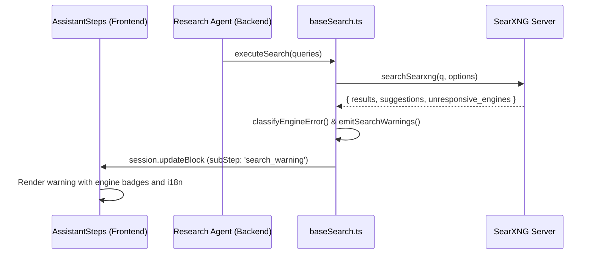

# Architecture of CAPTCHA, Rate-Limit and Search-Engine Error Detection (Search Warnings)

## 1. Concept and Purpose

The SearXNG search engine aggregates queries across many public search engines (Google, Bing, DuckDuckGo, Brave, etc.). External engines periodically impose blocks (e.g. Cloudflare CAPTCHA on DuckDuckGo, HTTP 429 Too Many Requests on Brave Search, 403 Access Denied errors, or timeouts).

So that both the user and the agent have full visibility into the reasons behind a possible lack of results or other limitations, Vane automatically:
1. Captures and categorizes the `unresponsive_engines` list from the SearXNG response.
2. Emits `search_warning` sub-steps in the research block (`ResearchBlock.data.subSteps`).
3. Displays real-time warnings in the `AssistantSteps` component with a dedicated icon (`AlertTriangle`), warning colors (amber), and badges for the blocked engines.
4. Provides full localization (i18n) for all 12 languages supported by the system.

---

## 2. Data Flow



---

## 3. Type Structure (`src/lib/types.ts`)

```typescript
export type SearchWarningResearchBlock = {
  id: string;
  type: 'search_warning';
  warningType: 'captcha' | 'rate_limit' | 'blocked' | 'error' | 'no_results';
  engines: string[];
  message?: string;
};

export type ResearchBlockSubStep =
  | ReasoningResearchBlock
  | SearchingResearchBlock
  | SearchResultsResearchBlock
  | ReadingResearchBlock
  | UploadSearchingResearchBlock
  | UploadSearchResultsResearchBlock
  | SearchWarningResearchBlock;
```

---

## 4. Error Classification (`src/lib/searxng.ts`)

The function `classifyEngineError(error: string)` analyzes the content of the error message returned by SearXNG:
- **`captcha`**: errors containing the keyword `captcha` (e.g. `CAPTCHA (us-en)` from DuckDuckGo).
- **`rate_limit`**: errors containing `too many request`, `429`, `rate limit`, `ratelimit`.
- **`blocked`**: codes `403`, `access denied`, `forbidden`, `blocked`.
- **`error`**: other network and communication errors.

---

## 5. UI Presentation (`src/components/AssistantSteps.tsx`)

- **Icon:** `AlertTriangle` with an amber accent (`text-amber-500 dark:text-amber-400`).
- **Step title:**
  - `chat.captchaDetected`: `CAPTCHA detected on engines: {engines}`
  - `chat.rateLimitDetected`: `Rate limit reached on: {engines}`
  - `chat.engineErrorDetected`: `Search engine error ({engines})`
  - `chat.noResultsFound`: `No search results found`
- **Engine tags:** the list of engines that reported the given issue, rendered as neat amber-colored badges.

---

## 6. Multi-language Support (i18n)

All messages are implemented in 12 locale files (`src/lib/i18n/locales/*.ts`):
- `pl` (Polish)
- `en` (English)
- `de` (German)
- `es` (Spanish)
- `fr` (French)
- `it` (Italian)
- `ja` (Japanese)
- `ko` (Korean)
- `pt` (Portuguese)
- `ru` (Russian)
- `uk` (Ukrainian)
- `zh` (Chinese)
